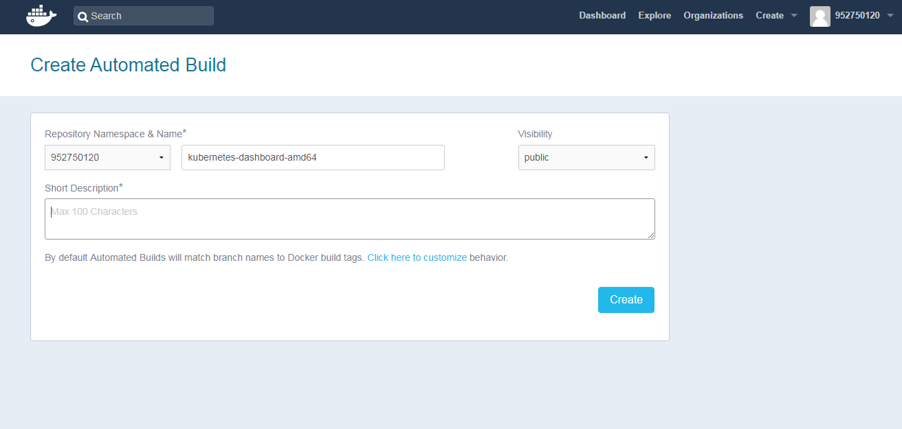

### 自动构建docker

	kubernetes-dashboard-amd64

在 github 创建一个 repository，里面有一个 Dockerfile

	FROM gcr.io/google_containers/kubernetes-dashboard-amd64:v1.8.4
	MAINTAINER zouhuigang <zouhuigang888@gmail.com>

登录docker hub:

	https://hub.docker.com/

选择create-> Create Automated Build->Link Accounts->Link Github->Select->github登录授权

再次选择Create Automated Build点击github会获取github所有的项目。

搜索我们的项目:kubernetes-dashboard-amd64,点击进去

点击create!

完成之后，得到镜像:

	https://hub.docker.com/r/952750120/kubernetes-dashboard-amd64/

问题：

Q1：docker hub构建失败

	Building in Docker Cloud's infrastructure...
	Cloning into '.'...

	Dockerfile not found at ./Dockerfile

A1：

	将DOCKERFILE重命名为:Dockerfile

