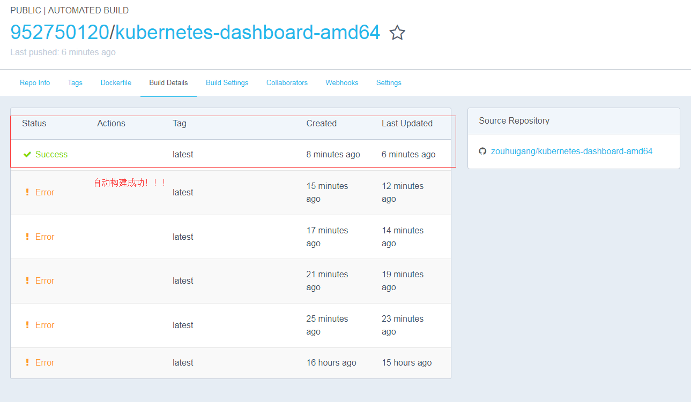
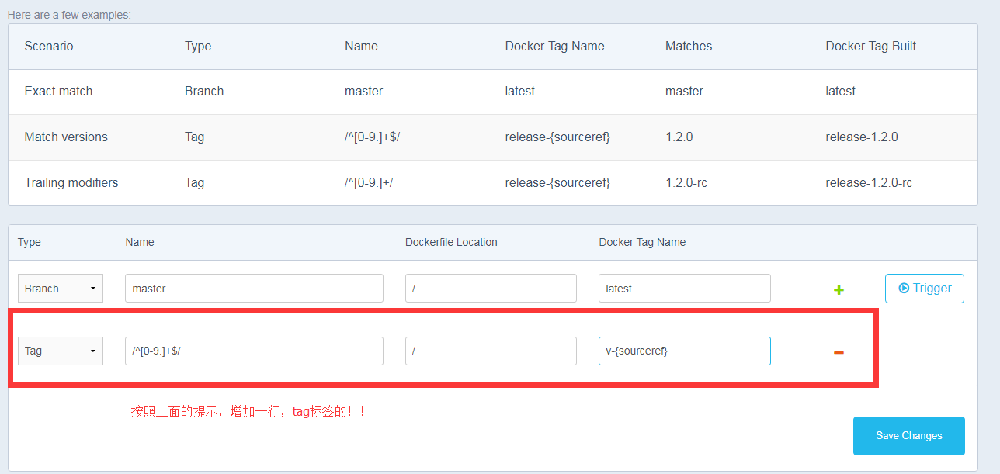

### 自动构建docker

	kubernetes-dashboard-amd64

在 github 创建一个 repository，里面有一个 Dockerfile

	FROM gcr.io/google_containers/kubernetes-dashboard-amd64:v1.8.4
	MAINTAINER zouhuigang <zouhuigang888@gmail.com>

登录docker hub:

	https://hub.docker.com/

选择create-> Create Automated Build->Link Accounts->Link Github->Select->github登录授权

再次选择Create Automated Build点击github会获取github所有的项目。

搜索我们的项目:kubernetes-dashboard-amd64,点击进去

点击create!

完成之后，得到镜像:

	https://hub.docker.com/r/952750120/kubernetes-dashboard-amd64/

### 问题：

Q1：docker hub构建失败

	Building in Docker Cloud's infrastructure...
	Cloning into '.'...

	Dockerfile not found at ./Dockerfile

A1：

	将DOCKERFILE重命名为:Dockerfile
	需要先将github库中的DOCKERFILE删除掉，再增加，不然不会重命名:Dockerfile,提交成功之后dockerhub会自动构建镜像。

Q2：

	Build failed: manifest for gcr.io/google_containers/kubernetes-dashboard-amd64:v1.8.4 not found

A2：

	改成gcr.io/google_containers/kubernetes-dashboard-amd64:v1.8.1

Q3:

自动构建的镜像，怎么自动打上tag标签。

A3:

之后提交git用:

	git add -A
	git commit -am "测试自动构建标签"
	git tag -a v1.8.1 -m 'kubernetes-dashboard-amd64:v1.8.1'
	git push origin v1.8.1

删除远程tag标签,tag标签貌似不能更新代码,所以只能先删除，后重新创建tag了：

	git push origin --delete tag v1.8.1

Q4:

	使用标签后，发现不能构建镜像，经过发现，原来是tag匹配不对

A4:

Type | Name | Dockerfile Location | Docker Tag Name
-----|------|---------------------|----------------
Tag | /^[0-9.]+$/ | / |release-{sourceref}

之前提交给github的tag标签为v.1.8.1发现不能匹配，改成了1.8.1就好了或者直接修改docker hub的name标签为:/^v[0-9.]+$/ 。

Type | Name | Dockerfile Location | Docker Tag Name
-----|------|---------------------|----------------
Tag | /^v[0-9.]+$/ | / |{sourceref}填入进去是空白的，默认就是这个
	     

### git tag用法

1.列出所有tag

	git tag 

2.删除远程tag

	
	git push origin --delete tag v1.8.1

3.删除本地tag

	git tag -d v1.8.1

4.新建tag

	
	git tag -a v1.8.1 -m 'kubernetes-dashboard-amd64:v1.8.1'

